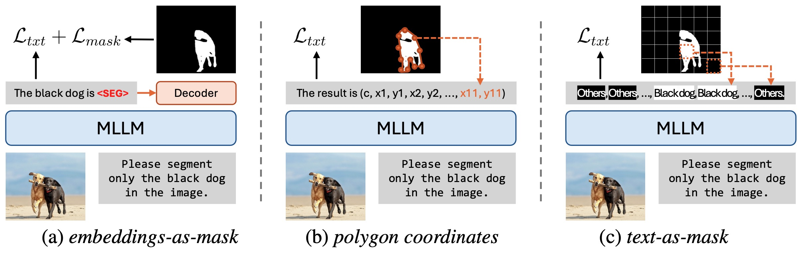

<div align="center">
<h1>Text4Seg: Reimagining Image Segmentation as Text Generation</h1>

<div>
    <a href='https://mc-lan.github.io/' target='_blank'>Mengcheng Lan</a><sup>1</sup>&emsp;
    <a href='https://chaofengc.github.io/' target='_blank'>Chaofeng Chen</a><sup>1</sup>&emsp;
    <a href='https://zytx121.github.io/' target='_blank'>Yue Zhou</a><sup>1</sup>&emsp;   
    <a href='https://angusmonroe.cn/' target='_blank'>Jiaxing Xu</a><sup>2</sup>&emsp;
    <a href='https://keyiping.wixsite.com/index' target='_blank'>Yiping Ke</a><sup>2</sup>&emsp;
    <a href='https://scholar.google.com.hk/citations?user=q4lnWaoAAAAJ&hl=en&inst=8669986779262753491&oi=ao' target='_blank'>Xinjiang Wang</a><sup>3</sup>&emsp;
    <a href='https://scholar.google.com.hk/citations?user=PnNAAasAAAAJ&hl=en' target='_blank'>Litong Feng</a><sup>3</sup>&emsp;
    <a href='https://www.statfe.com/' target='_blank'>Wayne Zhang</a><sup>3</sup>&emsp;
</div>
<div>
    <sup>1</sup>S-Lab, Nanyang Technological University&emsp; 
    <sup>2</sup>CCDS, Nanyang Technological University&emsp; 
    <sup>3</sup>SenseTime Research&emsp;
</div>

[]()
[](https://mc-lan.github.io/Text4Seg/)
[](http://arxiv.org/abs/2410.09855)


</div>

<p align="center">
    
</p>

---

## Abstract

*Multimodal Large Language Models (MLLMs) have shown exceptional capabilities in vision-language tasks; however, effectively integrating image segmentation into these models remains a significant challenge. 
In this paper, we introduce Text4Seg, a novel text-as-mask paradigm that casts image segmentation as a text generation problem, eliminating the need for additional decoders and significantly simplifying the segmentation process.
Our key innovation is semantic descriptors, a new textual representation of segmentation masks where each image patch is mapped to its corresponding text label.
This unified representation allows seamless integration into the auto-regressive training pipeline of MLLMs for easier optimization.
We demonstrate that representing an image with $16\times16$ semantic descriptors yields competitive segmentation performance. 
To enhance efficiency, we introduce the Row-wise Run-Length Encoding (R-RLE), which compresses redundant text sequences, reducing the length of semantic descriptors by 74\% and accelerating inference by $3\times$, without compromising performance. 
Extensive experiments across various vision tasks, such as referring expression segmentation and comprehension, show that Text4Seg achieves state-of-the-art performance on multiple datasets by fine-tuning different MLLM backbones. 
Our approach provides an efficient, scalable solution for vision-centric tasks within the MLLM framework.*

<div align="center">
  
  <div style="display: inline-block; color: #999; padding: 2px;">
      Different paradigms of MLLMs based image segmentation: (a) embeddings-as-mask paradigm that relies on additional segmentation decoder and loss (e.g., LISA); (b) polygon coordinates for instance segmentation (e.g., VisionLLM); (c) our text-as-mask paradigm that relies on semantically consistent text sequences..
  </div>
</div>

---

## 📢 Latest Updates

- **12/2024:** We release the code and datasets.

---

## Dependencies and Installation

```
# git clone this repository
git clone https://github.com/mc-lan/Text4Seg.git
cd Text4Seg

# create new anaconda env
conda create -n Text4Seg python=3.10
conda activate Text4Seg

# install torch and dependencies
pip install -e ".[train]"
pip install flash-attn --no-build-isolation
```

**For the project based on ms-swift (Tables 1, 2, 3)**, please check out [Text4Seg/ms-swift](https://github.com/mc-lan/Text4Seg/tree/main/ms-swift).

## Datasets
- [llava_v1_5_mix665k.json](https://huggingface.co/datasets/liuhaotian/LLaVA-Instruct-150K/blob/main/llava_v1_5_mix665k.json)
    - COCO: [train2017](http://images.cocodataset.org/zips/train2017.zip)
    - GQA: [images](https://downloads.cs.stanford.edu/nlp/data/gqa/images.zip)
    - OCR-VQA: [download script](https://drive.google.com/drive/folders/1_GYPY5UkUy7HIcR0zq3ZCFgeZN7BAfm_?usp=sharing)
    - TextVQA: [train_val_images](https://dl.fbaipublicfiles.com/textvqa/images/train_val_images.zip)
    - VisualGenome: [part1](https://cs.stanford.edu/people/rak248/VG_100K_2/images.zip), [part2](https://cs.stanford.edu/people/rak248/VG_100K_2/images2.zip)
- Referring expression segmentation dataset
    - [refCOCO](https://web.archive.org/web/20220413011718/https://bvisionweb1.cs.unc.edu/licheng/referit/data/refcoco.zip)
    - [refCOCO+](https://web.archive.org/web/20220413011656/https://bvisionweb1.cs.unc.edu/licheng/referit/data/refcoco+.zip)
    - [refCOCOg](https://web.archive.org/web/20220413012904/https://bvisionweb1.cs.unc.edu/licheng/referit/data/refcocog.zip)
    - [refCLEF](https://web.archive.org/web/20220413011817/https://bvisionweb1.cs.unc.edu/licheng/referit/data/refclef.zip) ([saiapr_tc-12](https://web.archive.org/web/20220515000000/http://bvisionweb1.cs.unc.edu/licheng/referit/data/images/saiapr_tc-12.zip)) 
- Semantic segmentation dataset
    - [COCOStuff](http://calvin.inf.ed.ac.uk/wp-content/uploads/data/cocostuffdataset/stuffthingmaps_trainval2017.zip)
    - [ADE20K](https://ade20k.csail.mit.edu/)
    - [PASCAL VOC](http://host.robots.ox.ac.uk/pascal/VOC/voc2012/)
    - [PASCAL Context](https://cs.stanford.edu/~roozbeh/pascal-context/)

Download them from the above links, and organize them as follows.
```
├── playground/data
│   ├── refer_seg
│   │   ├── grefcoco
|   |       ├── grefs(unc).json
│   │   ├── images
|   |       ├── coco_2014
|   |       ├── saiapr_tc-12
│   │   ├── refclef
|   |       ├── instances.json
│   │   ├── refcoco
|   |       ├── instances.json
│   │       └── ...
│   │   ├── refcoco+
|   |       ├── instances.json
│   │       └── ...
│   │   └── refcocog
|   |       ├── instances.json
│   │       └── ...
│   ├── semantic_seg
│   │   ├── ADE20K
│   │       ├── annotations
│   │       └── images
│   │   ├── PAS20
│   │       ├── JPEGImages
│   │       ├── SegmentationClass
│   │       └── val.txt
│   │   └── PC59
│   │       ├── JPEGImages
│   │       ├── SegmentationClassContext
│   │       └── pascalcontext_val.txt
|   ├── coco
|   │   └── train2017
|   ├── cocostuff
|   │   └── annotations
|   |       ├── 000000000009_labelTrainIds.png
|   |       └── ...
|   ├── gqa
│   |   └── images
|   ├── ocr_vqa
│   |   └── images
|   ├── textvqa
│   |   └── train_images
|   ├── vg
|   |    ├── VG_100K
|   |    └── VG_100K_2
|   └── llava_v1_5_mix665k.json
```
To evaluate the VQA performance, you need to prepare the evaluation datasets. Please download the [eval.zip](https://drive.google.com/file/d/1atZSBBrAX54yYpxtVVW33zFvcnaHeFPy/view) and extract its contents to `./playground/data/eval`.

## Json files
Generate the json files:
```
python playground/data/create_json/create_refcoco.py
python playground/data/create_json/create_grefercoco.py
python playground/data/create_json/create_cocostuff.py
```


## Pre-trained weights
Download the [clip-vit-large](https://huggingface.co/openai/clip-vit-large-patch14-336) and [vicuna-7b-v1.5](https://huggingface.co/lmsys/vicuna-7b-v1.5) weights from the Hugging Face to `pre_trained` folder.
Download the [mm_project.bin](https://huggingface.co/liuhaotian/llava-v1.5-mlp2x-336px-pretrain-vicuna-7b-v1.5) to `checkpoints/llava-v1.5-7b-pretrain` folder.
Download the [sam-h](https://github.com/facebookresearch/segment-anything#model-checkpoints) to `llava/model/segment_anything` folder.

## Quick Inference
Please note that this checkpoint was trained on a combination of the LLaVA v1.5 mix665k dataset, the RefCOCO series, the GrefCOCO dataset, and the COCOStuff dataset for demonstration purposes.
```
python llava/eval/run_llava.py --model-path="lmc22/text4seg-7b-p24" --image-file="images/horses.jpg" --query="Please segment the white horse in this image."
```

## Model evaluation
Referring expression segmengtation:
```
bash scripts/v1_5/eval/refer_seg.sh
```

Open-vocabulary semantic segmentation:
```
bash scripts/v1_5/eval/semantic_seg.sh 
```

## Model training
```
bash scripts/v1_5/eval/refer_seg.sh
```


## Citation

```
@misc{lan2024text4segreimaginingimagesegmentation,
      title={Text4Seg: Reimagining Image Segmentation as Text Generation}, 
      author={Mengcheng Lan and Chaofeng Chen and Yue Zhou and Jiaxing Xu and Yiping Ke and Xinjiang Wang and Litong Feng and Wayne Zhang},
      year={2024},
      eprint={2410.09855},
      archivePrefix={arXiv},
      primaryClass={cs.CV},
      url={https://arxiv.org/abs/2410.09855}, 
}
```

## License
This project is licensed under <a rel="license" href="https://github.com/mc-lan/Text4Seg/blob/master/LICENSE">NTU S-Lab License 1.0</a>. Redistribution and use should follow this license.


## Acknowledgement
This study is supported under the RIE2020 Industry Align- ment Fund – Industry Collaboration Projects (IAF-ICP) Funding Initiative, as well as cash and in-kind contribution from the industry partner(s).

This implementation is based on [LLaVa](https://github.com/haotian-liu/LLaVA) and [ms-swift](https://github.com/modelscope/ms-swift). Thanks for the awesome work.

## Contact
If you have any questions, please feel free to reach out at `lanm0002@e.ntu.edu.sg`.
