<div align="center">
<h1>Text4Seg: Reimagining Image Segmentation as Text Generation</h1>

<div>
    <a href='https://mc-lan.github.io/' target='_blank'>Mengcheng Lan</a><sup>1</sup>&emsp;
    <a href='https://chaofengc.github.io/' target='_blank'>Chaofeng Chen</a><sup>1</sup>&emsp;
    <a href='https://zytx121.github.io/' target='_blank'>Yue Zhou</a><sup>1</sup>&emsp;   
    <a href='https://angusmonroe.cn/' target='_blank'>Jiaxing Xu</a><sup>2</sup>&emsp;
    <a href='https://keyiping.wixsite.com/index' target='_blank'>Yiping Ke</a><sup>2</sup>&emsp;
    <a href='https://scholar.google.com.hk/citations?user=q4lnWaoAAAAJ&hl=en&inst=8669986779262753491&oi=ao' target='_blank'>Xinjiang Wang</a><sup>3</sup>&emsp;
    <a href='https://scholar.google.com.hk/citations?user=PnNAAasAAAAJ&hl=en' target='_blank'>Litong Feng</a><sup>3</sup>&emsp;
    <a href='https://www.statfe.com/' target='_blank'>Wayne Zhang</a><sup>3</sup>&emsp;
</div>
<div>
    <sup>1</sup>S-Lab, Nanyang Technological University&emsp; 
    <sup>2</sup>CCDS, Nanyang Technological University&emsp; 
    <sup>3</sup>SenseTime Research&emsp;
</div>

[]()
[](https://lizhou-cs.github.io/mglmm.github.io)
[](https://arxiv.org/abs/2409.13407)


</div>

<p align="center">
    
</p>

---

## 📢 Latest Updates

- 🌟 We will release the Text4Seg demo, code and datasets as soon as possible. 🌟

---

## Abstract

*Multimodal Large Language Models (MLLMs) have shown exceptional capabilities in vision-language tasks; however, effectively integrating image segmentation into these models remains a significant challenge. 
In this paper, we introduce Text4Seg, a novel text-as-mask paradigm that casts image segmentation as a text generation problem, eliminating the need for additional decoders and significantly simplifying the segmentation process.
Our key innovation is semantic descriptors, a new textual representation of segmentation masks where each image patch is mapped to its corresponding text label.
This unified representation allows seamless integration into the auto-regressive training pipeline of MLLMs for easier optimization.
We demonstrate that representing an image with $16\times16$ semantic descriptors yields competitive segmentation performance. 
To enhance efficiency, we introduce the Row-wise Run-Length Encoding (R-RLE), which compresses redundant text sequences, reducing the length of semantic descriptors by 74\% and accelerating inference by $3\times$, without compromising performance. 
Extensive experiments across various vision tasks, such as referring expression segmentation and comprehension, show that Text4Seg achieves state-of-the-art performance on multiple datasets by fine-tuning different MLLM backbones. 
Our approach provides an efficient, scalable solution for vision-centric tasks within the MLLM framework.*

<div align="center">
  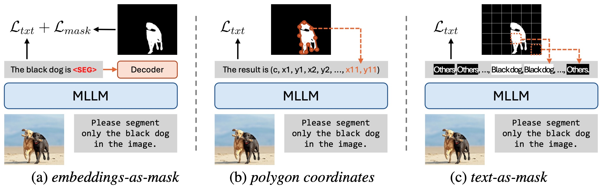
  <div style="display: inline-block; color: #999; padding: 2px;">
      Different paradigms of MLLMs based image segmentation: (a) embeddings-as-mask paradigm that relies on additional segmentation decoder and loss (e.g., LISA); (b) polygon coordinates for instance segmentation (e.g., VisionLLM); (c) our text-as-mask paradigm that relies on semantically consistent text sequences..
  </div>
</div>

---

## 🏆 Contributions

- **Semantic descriptors.** We introduce semantic descriptors, a textual sequence representation of segmentation masks that seamlessly integrates with existing MLLMs for easier optimization. We demonstrate that $16\times16$ semantic descriptors are sufficient for achieving strong performance.

- **R-RLE.** We develop Row-wise Run-Length Encoding (R-RLE) to compress semantic descriptors, significantly reducing its length and inference costs without compromising performance.

- **Text4Seg framework.** We propose TextSeg, a novel text-as-mask paradigm that redefines image segmentation as a text generation problem, fully leveraging the text generation capabilities of MLLMs.

---

## 💬 Semantic Descriptors and Row-wise Run-Length Encoding
Without compromising performance, R-RLE achieves a 74% reduction in semantic descriptors length and  speeds up inference by 3×on average
<p align="center">
  
</p>

---

## 🔍 Text4Seg Framework

The left side of the figure illustrates the proposed visual instruction data format, and the right side illustrates the model architecture of Text4Seg. Text4Seg could be seamlessly built upon existing MLLMs without any modifications to the model architecture.

<p align="center">
  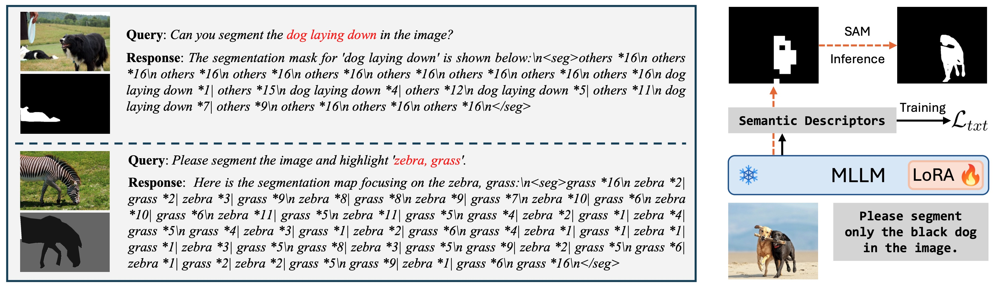
</p>

---

## 🚀 Qualitative and Quantitative results

### 📷 Referring Expression Segmentation (RES) (Single Target)

<div align="center">
  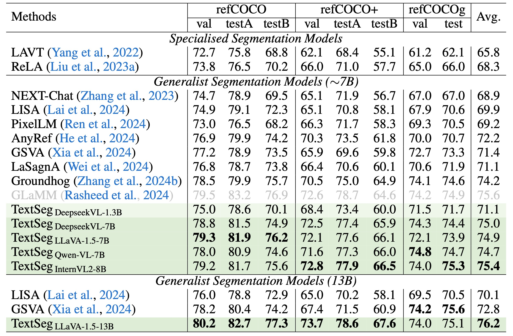
</div>

<div align="center">
  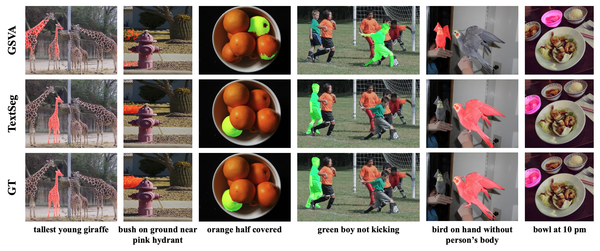
  <div style="display: inline-block; color: #999; padding: 2px;">
      Performance on refCOCO series benchmark.
  </div>
</div>

---

### 📷 Generalized Referring Expression Segmentation (GRES) (Multiple and Empty Targets)

<div align="center">
  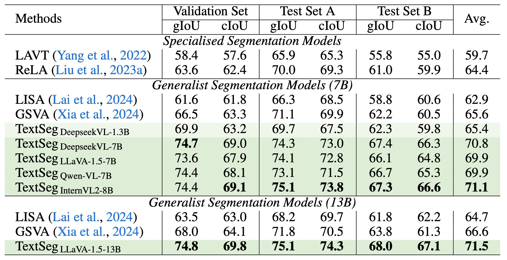
</div>


<div align="center">
  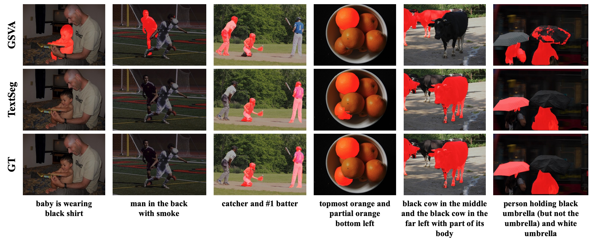
  <div style="display: inline-block; color: #999; padding: 2px;">
      Performance on grefCOCO benchmark.
  </div>
</div>

---

### 📷 Referring Expression Comprehension (REC)
TextSeg can be directly applied in object detection with a simple mask2box paradigm, which first generates a segmentation mask based on the input and then derives the bounding box from the mask.

<div align="center">
  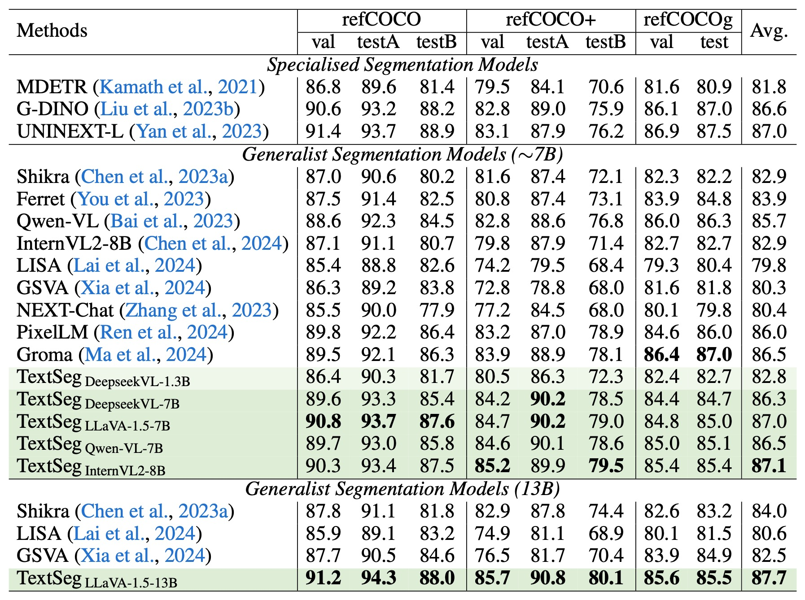
</div>


<div align="center">
  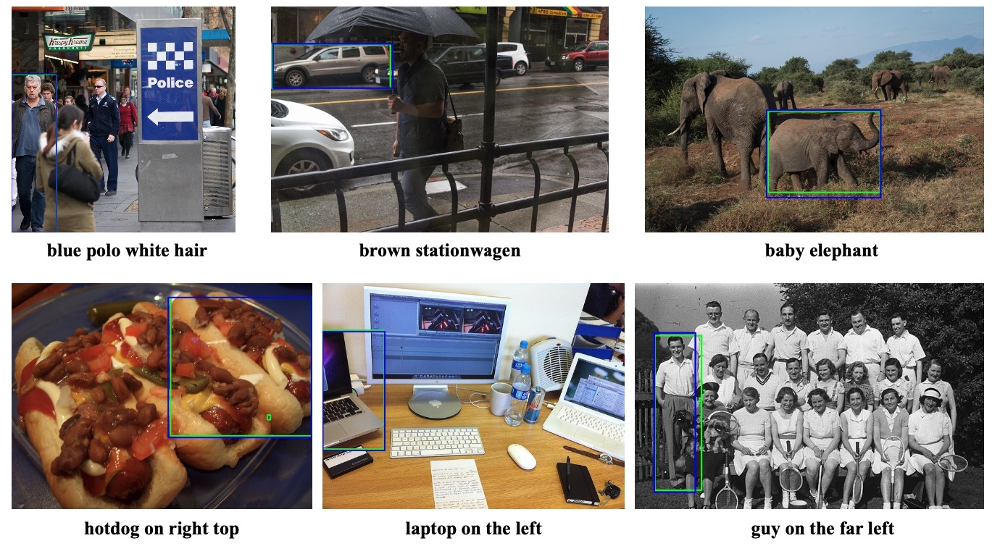
  <div style="display: inline-block; color: #999; padding: 2px;">
      Performance on refCOCO series benchmark.
  </div>
</div>

---

### 📷 Open-vocabulary Semantic Segmentation (OVSS)
TextSeg is built upon LLaVA-1.5-7B and trained on the COCOStuff-171 dataset.

<div align="center">
  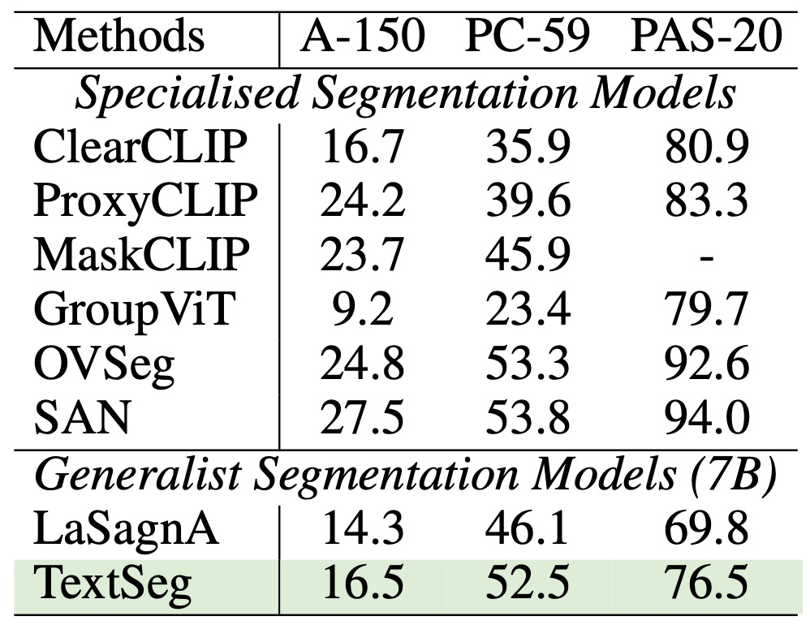
</div>


<div align="center">
  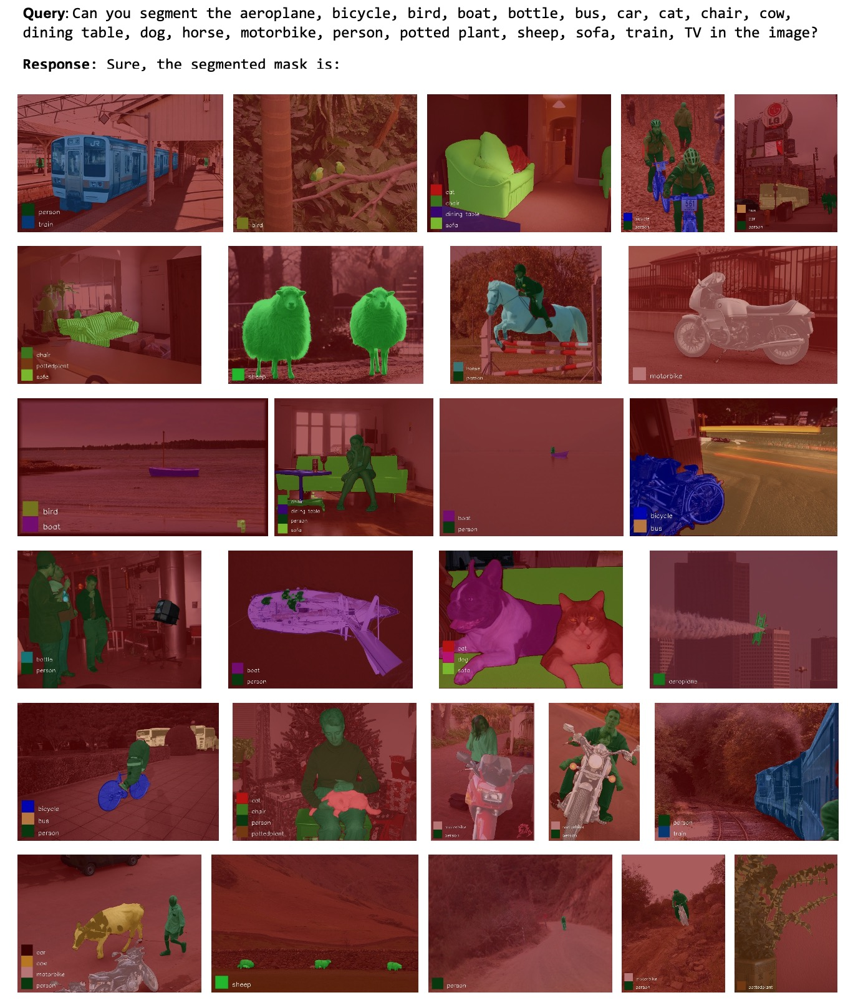
  <div style="display: inline-block; color: #999; padding: 2px;">
      Performance on PASCAL VOC 20 benchmark.
  </div>
</div>

<div align="center">
  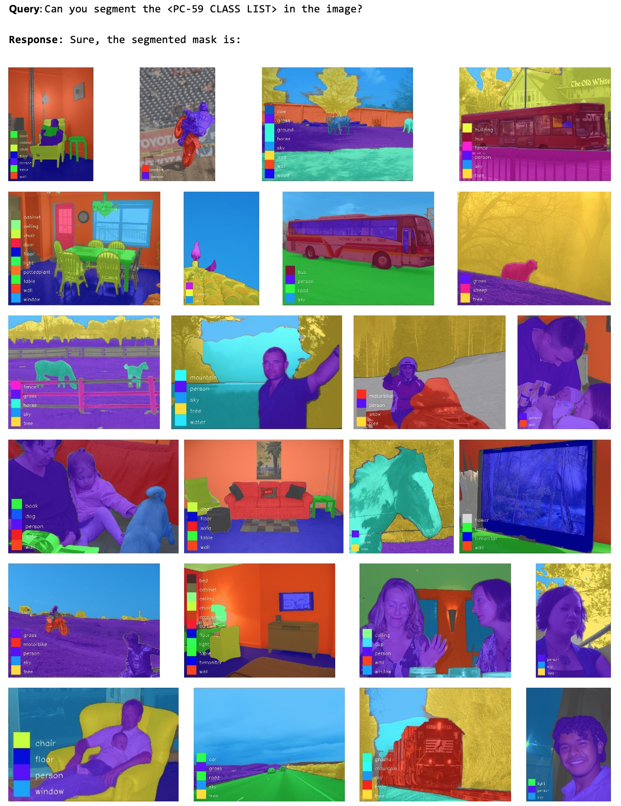
  <div style="display: inline-block; color: #999; padding: 2px;">
      Performance on Pascal Context 59 benchmark.
  </div>
</div>

---

 ### 📷 Visual Question Answering (VQA)
Our text-as-mask paradigm allows for seamless integration of downstream segmentation task into the pre-training of MLLMs. TextSeg, built upon the stage-2 of LLaVA-1.5-7B, is trained on both the LLaVA-v1.5-
mix665k dataset and our referring segmentation datasets. 
<div align="center">
  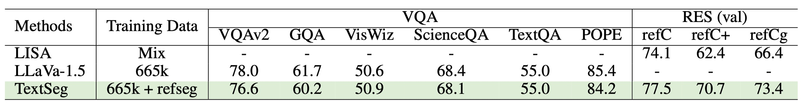
</div>

<div align="center">
  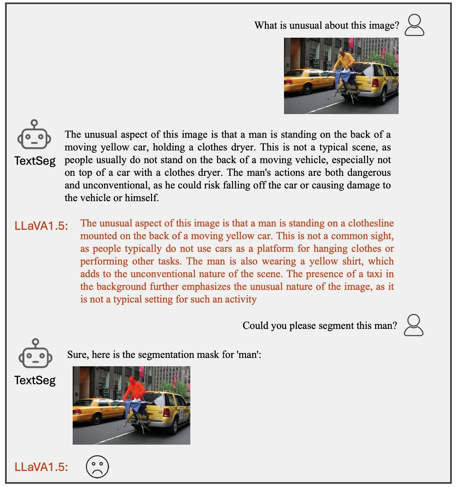
  <div style="display: inline-block; color: #999; padding: 2px;">
    Performance comparison on Visual understanding.
  </div>
</div>

## 📜 Citation
```bibtex
@article{lan2024text4seg,
  title={Text4Seg: Reimagining Image Segmentation as Text Generation},
  author={Lan, Mengcheng and Chen, Chaofeng and Zhou, Yue and Xu, Jiaxing and Ke, Yiping and Wang, Xinjiang and Feng, Litong and Zhang, Wayne},
  journal={arXiv},
  year={2024}
```

---
## 🙏 Acknowledgement

